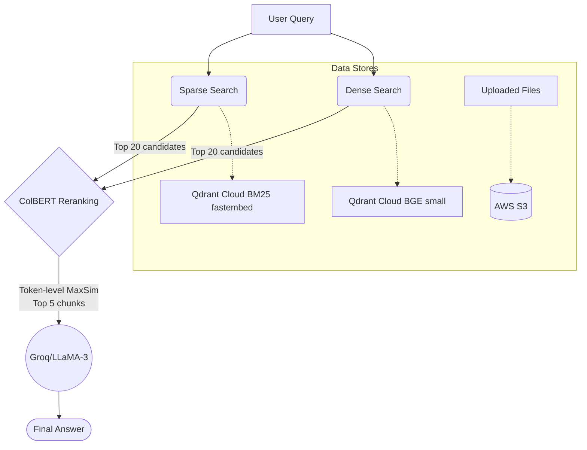

<div align="center">
  <h1>🔍 FusionRAG</h1>
  <p><strong>A Production-Grade Hybrid Retrieval System</strong></p>

  [](https://www.python.org)
  [](https://fastapi.tiangolo.com)
  [](https://reactjs.org)
  [](https://qdrant.tech/)
  [](https://aws.amazon.com/s3/)
  [](https://opensource.org/licenses/Apache-2.0)
</div>

<br>

A robust, LangChain-free Retrieval-Augmented Generation (RAG) system with a three-stage hybrid retrieval pipeline. **FusionRAG** combines dense, sparse, and late-interaction (ColBERT) mechanisms to fetch with precision, grounded in factually accurate language generation.

---

## ✨ Key Features

- **Three-Stage Pipeline:** Fuses keyword (BM25) and semantic (Dense) search, re-ranked via token-precise ColBERT.
- **Zero Abstract Overhead:** Direct integrations (no LangChain/LlamaIndex) for enhanced speed, transparency, and hackability.
- **Lightning Fast Inference:** Powered by Groq's high-speed Llama 3 models for ultra-low latency text generation.
- **Cloud-Ready Storage:** Uploads files to **AWS S3** and indexes vectors in **Qdrant Cloud**.
- **Fully Containerized:** One-click deployment with Docker Compose spins up the API, Qdrant, and the React client.

---

## 🏗️ Architecture Flow



**Why Three Stages?**
- **Sparse (BM25)** ensures you never miss exact-match keywords (e.g., specific serial numbers, unique names).
- **Dense (semantic)** captures intent and context that exact keywords miss.
- **ColBERT Reranker** acts as the high-precision filter using fine-grained token-level cross-attention—without the latency of standard Cross-Encoders.

---

## 📊 Evaluation Metrics (RAGAS)

Evaluated against 20 held-out questions from the deeply technical *Attention Is All You Need* paper. 

| Metric | Score | Insight |
| :--- | :---: | :--- |
| **Faithfulness** | `0.979` | High consistency; hallucinations are highly suppressed. |
| **Answer Relevancy** | `0.923` | Direct and concise; answers purely what was asked. |
| **Context Recall** | `0.828` | Successfully retrieves all statements required for the answer. |
| **Context Precision** | `0.802` | Ground truth context ranks effectively at the top. |

---

## 🛠️ Technology Stack

- **Backend AI Engine:** FastAPI, Python
- **Vector Store:** Qdrant Cloud
- **File Storage:** AWS S3
- **Embeddings:**
  - Dense: `BAAI/bge-small-en-v1.5`
  - Sparse: `Qdrant/bm25` (via `fastembed`)
- **Reranker:** `colbert-v2.0`
- **LLM Interface:** Groq (`llama-3.3-70b-versatile`)
- **Frontend / UI:** React JS, Vite, Tailwind CSS (optional)

---

## 🚀 Quickstart

1. **Clone the Repository**
   ```bash
   git clone https://github.com/your-username/FusionRAG.git
   cd FusionRAG
   ```

2. **Configure Environment Variables**
  Create a `.env` file in the `backend/` directory (or export it to your environment), holding your Groq key, Qdrant Cloud connection, and S3 credentials:
   ```bash
  echo "GROQ_API_KEY=your_groq_api_key_here" > backend/.env
  echo "QDRANT_URL=https://your-qdrant-cloud-url" >> backend/.env
  echo "QDRANT_API_KEY=your_qdrant_api_key_here" >> backend/.env
  echo "AWS_ACCESS_KEY_ID=your_aws_access_key_here" >> backend/.env
  echo "AWS_SECRET_ACCESS_KEY=your_aws_secret_api_key_here" >> backend/.env
  echo "BUCKET_NAME=your_s3_bucket_name" >> backend/.env
   ```

3. **Spin Up with Docker Compose**
   ```bash
  docker compose up --build
   ```

**Services Deployed**
- **Web UI:** [http://localhost:5173](http://localhost:5173)
- **API Server:** [http://localhost:8000](http://localhost:8000)
- **Qdrant Dashboard:** Your Qdrant Cloud dashboard URL

---

## ⚡ API Endpoints

### `POST /ingest`
Uploads files to **AWS S3** and indexes chunks into **Qdrant Cloud**. Support for `.pdf`, `.txt`, `.docx`.

```bash
curl -X POST http://localhost:8000/ingest \
  -F "file=@attention-paper.pdf"
```
**Response:**
```json
{
  "message": "Document Uploaded and Indexed Successfully",
  "path": "s3://your-bucket/attention-paper.pdf"
}
```

### `POST /chat`
Submits a query against the context of the ingested documents.

```bash
curl -X POST http://localhost:8000/chat \
  -H "Content-Type: application/json" \
  -d '{"query": "What BLEU score did the Transformer achieve?"}'
```
**Response:**
```json
{
  "question": "What BLEU score did the Transformer achieve?",
  "answer": "The Transformer big model achieved 28.4 BLEU on WMT 2014 English-to-German.",
  "source": "attention-paper.pdf"
}
```

---

## 🧠 Core Engineering Decisions

<details>
<summary><strong>Why no LangChain or LlamaIndex?</strong></summary>
We build all retrieval, chunking, and generative pipelines explicitly. This averts overhead, unpredictable prompts, opaque abstraction layers, and creates a vastly more debuggable and performant production system.
</details>

<details>
<summary><strong>Why ColBERT over Cross-Encoder Reranking?</strong></summary>
ColBERT pre-computes token-level embeddings during document indexing. At query time, it performs a lightweight MaxSim operation rather than forcing the neural network to score massive query-document pairs on the fly, unlocking scalable latency sizes.
</details>

<details>
<summary><strong>Why Qdrant BM25 over Standard Modifier.IDF?</strong></summary>
Standard `Modifier.IDF` processes only internal IDF weighting—meaning it lacks TF mapping, k1 parameters, b constraints, and document length normalization. Using `fastembed`'s complete `Qdrant/bm25` provides a much purer, standard conformant sparse retrieval out of the box.
</details>

---

<p align="center">
  <i>Developed with ❤️ for powerful open-source RAG architectures.</i>
</p>