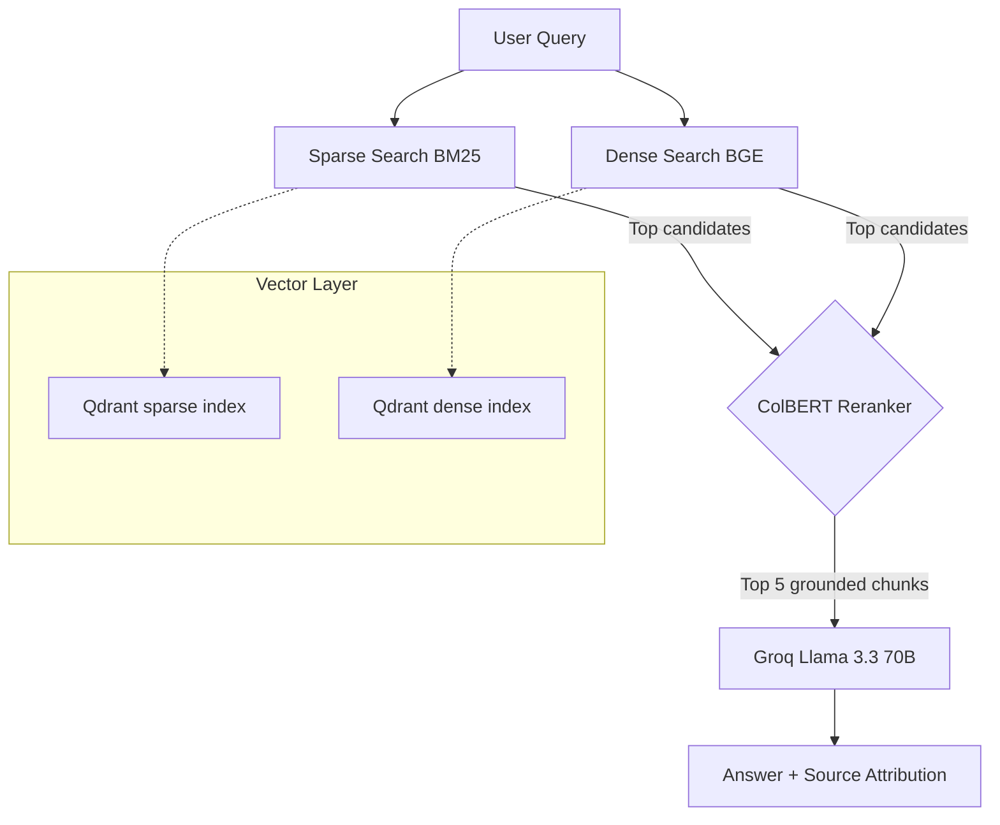

<div align="center">
  <h1>FusionRAG</h1>
  <p><strong>A Production-Grade, LangChain-Free Hybrid Retrieval System</strong></p>

  <p>
    <a href="https://www.python.org"></a>
    <a href="https://fastapi.tiangolo.com"></a>
    <a href="https://reactjs.org"></a>
    <a href="https://qdrant.tech/"></a>
    <a href="https://opensource.org/licenses/Apache-2.0"></a>
  </p>

  <p>
    <a href="https://github.com/GajananDhangude/FusionRAG/stargazers"></a>
    <a href="https://github.com/GajananDhangude/FusionRAG/fork"></a>
    <a href="https://github.com/GajananDhangude/FusionRAG/issues"></a>
  </p>

  <p>
    <a href="https://github.com/GajananDhangude/FusionRAG/stargazers"><strong>Give it a Star</strong></a>
    ·
    <a href="#-quickstart-in-3-steps"><strong>Run in 3 Steps</strong></a>
    ·
    <a href="#-architecture-why-fusion-works"><strong>See Architecture</strong></a>
  </p>
</div>

FusionRAG is a robust Retrieval-Augmented Generation stack with a three-stage retrieval engine that combines sparse, dense, and late-interaction reranking for highly grounded answers and low hallucination risk.

## Star and Demo

If this project helped you, please star it to support future improvements.

<p align="center">
  <a href="https://github.com/GajananDhangude/FusionRAG/stargazers">
    
  </a>
</p>

Watch growth over time:

[](https://www.star-history.com/#GajananDhangude/FusionRAG&Date)

Want a video button right now? Replace the URL below with your demo link:

[](https://www.youtube.com/watch?v=YOUR_VIDEO_ID)

## Why FusionRAG Stands Out

- Three-stage retrieval: BM25 + dense vectors + ColBERT reranking.
- No framework lock-in: direct implementations without LangChain or LlamaIndex.
- Fast generation path: Groq-backed Llama inference.
- Production-ready structure: API, vector store, and frontend fully containerized.
- Strong grounded quality: high faithfulness and relevancy in RAGAS evaluation.

## Architecture: Why Fusion Works


```mermaid
flowchart TD
    Q[User Query] --> S[Sparse Search BM25]
    Q --> D[Dense Search BGE]

    S -->|Top candidates| R{ColBERT Reranker}
    D -->|Top candidates| R

    R -->|Top 5 grounded chunks| LLM[Groq Llama 3.3 70B]
    LLM --> A[Answer + Source Attribution]

    subgraph Vector Layer
        BM[Qdrant sparse index]
        BG[Qdrant dense index]
    end

    S -.-> BM
    D -.-> BG
```

Why this design works:

- Sparse retrieval catches exact terms and literals.
- Dense retrieval captures semantic intent and paraphrases.
- ColBERT MaxSim reranking increases precision before generation.

## Evaluation Snapshot (RAGAS)

Evaluated with 20 held-out questions from Attention Is All You Need.

| Metric | Score | What It Means |
| :--- | :---: | :--- |
| Faithfulness | 0.979 | Strong suppression of hallucinations. |
| Answer Relevancy | 0.923 | Answers stay tightly focused on the prompt. |
| Context Recall | 0.828 | Required supporting facts are typically retrieved. |
| Context Precision | 0.802 | Useful chunks rank high enough to guide generation. |

## Tech Stack

- Backend: FastAPI, Python
- Vector DB: Qdrant
- Dense Embeddings: BAAI/bge-small-en-v1.5
- Sparse Embeddings: Qdrant/bm25 via fastembed
- Reranker: colbert-v2.0
- LLM Provider: Groq with llama-3.3-70b-versatile
- Frontend: React + Vite
- Orchestration: Docker Compose

## Quickstart in 3 Steps

1. Clone the repository.

```bash
git clone https://github.com/GajananDhangude/FusionRAG.git
cd FusionRAG
```

2. Create backend environment variables in backend/.env.

```env
GROQ_API_KEY=your_groq_api_key_here
QDRANT_URL=http://qdrant:6333
QDRANT_API_KEY=your_qdrant_api_key_here
AWS_ACCESS_KEY_ID=your_aws_access_key_here
AWS_SECRET_ACCESS_KEY=your_aws_secret_api_key
BUCKET_NAME=your_s3_bucket_name
```

3. Start everything.

```bash
docker compose up --build
```

Services:

- Web UI: http://localhost:5173
- API: http://localhost:8000
- Qdrant Dashboard: http://localhost:6333/dashboard

## API Reference

POST /ingest

Uploads and indexes supported files such as PDF, TXT, and DOCX.

```bash
curl -X POST http://localhost:8000/ingest \
  -F "file=@attention-paper.pdf"
```

Sample response:

```json
{
  "message": "Document Uploaded and Indexed Successfully",
  "path": "./uploads/attention-paper.pdf"
}
```

POST /chat

Runs retrieval and generation over ingested documents.

```bash
curl -X POST http://localhost:8000/chat \
  -H "Content-Type: application/json" \
  -d '{"query": "What BLEU score did the Transformer achieve?"}'
```

Sample response:

```json
{
  "question": "What BLEU score did the Transformer achieve?",
  "answer": "The Transformer big model achieved 28.4 BLEU on WMT 2014 English-to-German.",
  "source": "attention-paper.pdf"
}
```

## Project Layout

```text
backend/
  api/          # FastAPI endpoints
  core/         # Chunking, retrieval, reranking, generation
  evals/        # Benchmarking and RAGAS evaluation assets
frontend/
  src/          # Chat UI, hooks, API services
compose.yaml    # Full-stack local orchestration
```

## Roadmap

- Add query tracing and latency dashboard.
- Add benchmark automation in CI.
- Add multi-collection routing for domain-specific corpora.
- Add optional online reranking fallback policies.

## Contributing

Issues and pull requests are welcome. If you have an idea to improve retrieval quality, latency, or observability, open an issue and share your approach.

## License

This project is licensed under Apache-2.0.

<p align="center">
  Built for serious RAG engineering: accurate retrieval, transparent components, and production-friendly deployment.
</p>